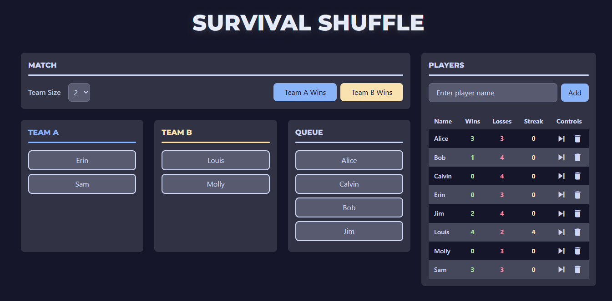

# Survivor Shuffle

Survivor Shuffle is a tournament tracker designed to help you organize teams, manage player rotations, and keep score for any multiplayer or group-based game where the winners continue to play and the losers continuously rotate out with new players based on the order they last played.

## Features

- **Add/Remove Players:** Add new players or remove them from the roster.
- **Team Management:** Automatically or manually assign players a team.
- **Queue System:** Players not on a team are placed in a queue until it is their turn to play.
- **Dynamic Team Size:** Change team sizes on the fly; teams rebalance automatically.
- **Match Results:** Record match outcomes and track wins, losses, and streaks for each player.
- **Skip Function:** Temporarily remove a player from play but keep their stats with a "Skip" toggle.
- **Reset:** Clear all players and teams.

## Deployment

This is a static site. You can deploy it to any static web host or open index.html directly.

## License

This project is licensed under the MIT License. See [LICENSE](LICENSE) for details.
